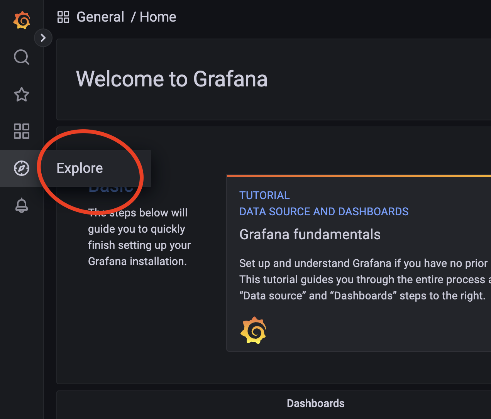
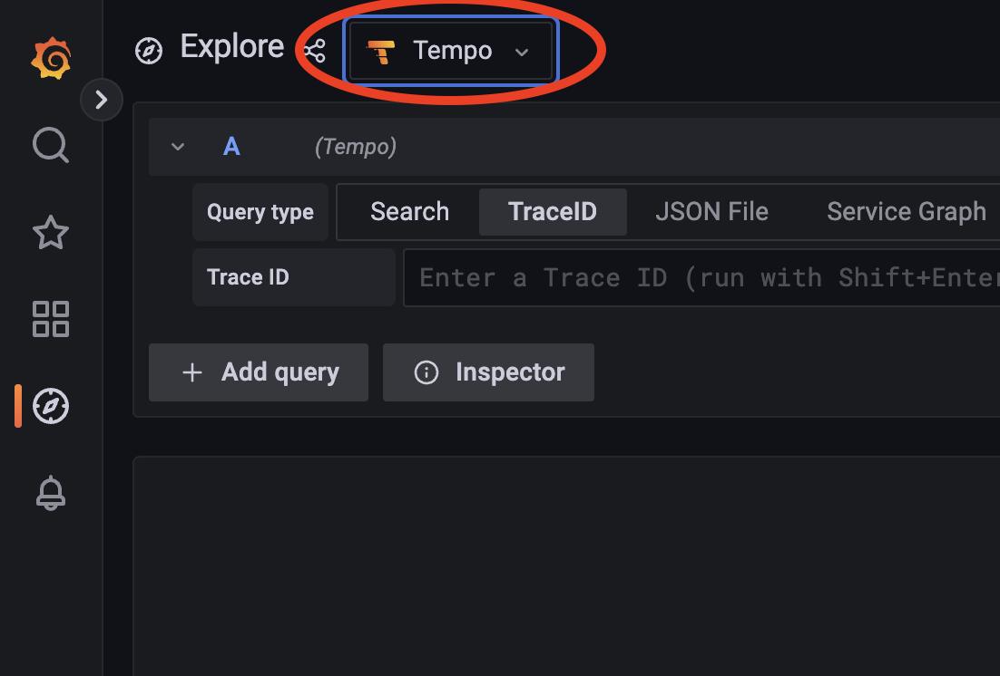
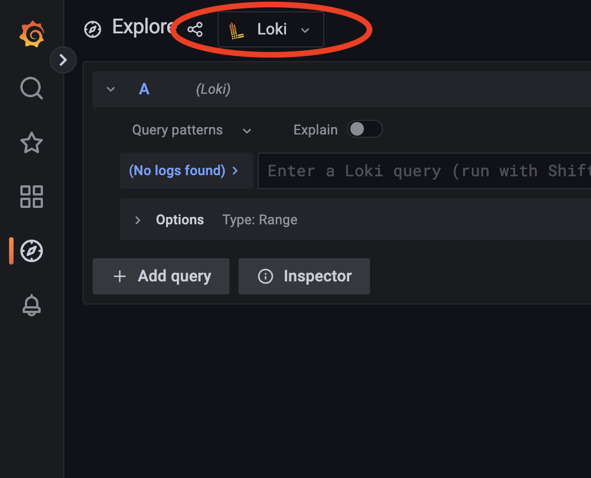

# Getting Started with Grafana

To use Grafana Tempo and Grafana Loki via docker compose, you need to first make sure that you have Docker installed on your local machine. Once you have Docker installed, you can create a docker-compose.yml file that defines the services for Grafana Tempo and Grafana Loki.

To run Grafana Tempo and Grafana Loki, you can use the following commands:


```
# Start the services defined in the docker-compose.yml file
docker-compose up
```

And to stop the services, you can use the following commands:

```
# Stop and remove the containers created by docker-compose
docker-compose down

# alternatively -v to remove any previously used disc volumes
#docker-compose down -v
```

Once the services are running, you can access the Grafana dashboard by visiting http://localhost:3000 in your browser. 

## Navigating Grafana

Once in Grafana, go to the "Explore" side-menu option.
From the explore view, you can then select Tempo or Loki as your datasource.



### Tempo

To use Tempo, you can select the "Tempo" datasource from the dropdown menu.



### Loki

To use Loki, you can select the "Loki" datasource from the dropdown menu.



Using LogQl to query Loki, you can use the following query to find all logs that contain the string "3139ba6b320f465e9e48a8195e7496b7" in the body field.

> Note: we are assuming the logs are in JSON format and not plain text here.

```
{service_name="CentralSystem"} | json | line_format "{{.body}}" |~ "3139ba6b320f465e9e48a8195e7496b7"
```

Let's break down the query:

The first part `{service_name="CentralSystem"}` is a label filter. This will filter the logs to only include logs that have the label `service_name` with the value `CentralSystem`.

The second part `| json | line_format "{{.body}}"` is a log pipeline. This will parse the log line as JSON and then format the log line to only include the `body` field.

The third part `|~ "3139ba6b320f465e9e48a8195e7496b7"` is a log filter. This will filter the logs to only include logs that contain the string `3139ba6b320f465e9e48a8195e7496b7`, ignoring case.

Query operators:

* `|` is a pipe operator. It is used to chain multiple operators together.
* `!` is a negation pipe operator. It is used to negate the result of the next operator.
* `=` is case sensitive equality. 
* `~` is case insensitive equality. 
* ´json´ is a log pipeline operator. It is used to parse the log line as JSON.
* `line_format` is a log pipeline operator. It is used to format the JSON to plain text.
* `{{.body}}` is the format template. it allows you to combine text with fields from the JSON log line.

